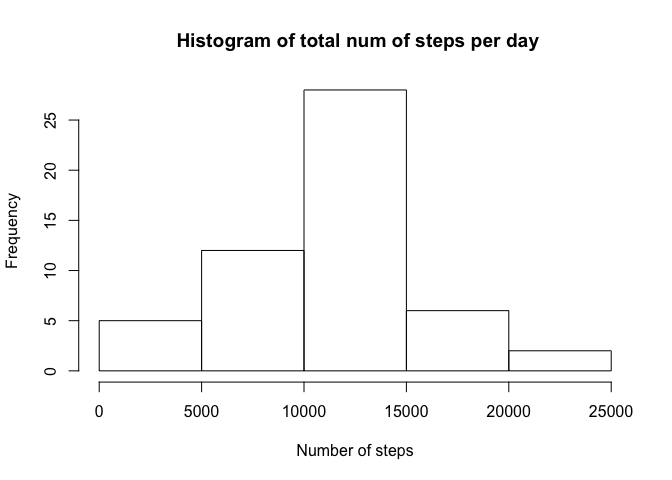

# Reproducible Research- Project 1
Sylvie Cottrell  
April 16, 2015  

## Loading and preprocessing the data


```r
library(plyr)
library(dplyr)
```

```
## 
## Attaching package: 'dplyr'
## 
## The following objects are masked from 'package:plyr':
## 
##     arrange, count, desc, failwith, id, mutate, rename, summarise,
##     summarize
## 
## The following object is masked from 'package:stats':
## 
##     filter
## 
## The following objects are masked from 'package:base':
## 
##     intersect, setdiff, setequal, union
```

```r
library(lubridate)
```

```
## 
## Attaching package: 'lubridate'
## 
## The following object is masked from 'package:plyr':
## 
##     here
```

```r
library(lattice)
```
1 - Load the data

```r
data <- read.csv("activity.csv")
data <- tbl_df(data)
```
2- Process/transform the data
 
Convert the date values from characters to DateTime objects

```r
data <- mutate(data, date = ymd(date))
head(data)
```

```
## Source: local data frame [6 x 3]
## 
##   steps       date interval
## 1    NA 2012-10-01        0
## 2    NA 2012-10-01        5
## 3    NA 2012-10-01       10
## 4    NA 2012-10-01       15
## 5    NA 2012-10-01       20
## 6    NA 2012-10-01       25
```

## What is mean total number of steps taken per day
1- Calculate the total number of steps taken per day
Take a subset of the data, omitting the missing values


```r
 df <- filter(data, !is.na(steps))
```

Create a table with the number of steps each day

```r
  by_day <- aggregate(df$steps, list(day = df$date), sum)
  by_day
```

```
##           day     x
## 1  2012-10-02   126
## 2  2012-10-03 11352
## 3  2012-10-04 12116
## 4  2012-10-05 13294
## 5  2012-10-06 15420
## 6  2012-10-07 11015
## 7  2012-10-09 12811
## 8  2012-10-10  9900
## 9  2012-10-11 10304
## 10 2012-10-12 17382
## 11 2012-10-13 12426
## 12 2012-10-14 15098
## 13 2012-10-15 10139
## 14 2012-10-16 15084
## 15 2012-10-17 13452
## 16 2012-10-18 10056
## 17 2012-10-19 11829
## 18 2012-10-20 10395
## 19 2012-10-21  8821
## 20 2012-10-22 13460
## 21 2012-10-23  8918
## 22 2012-10-24  8355
## 23 2012-10-25  2492
## 24 2012-10-26  6778
## 25 2012-10-27 10119
## 26 2012-10-28 11458
## 27 2012-10-29  5018
## 28 2012-10-30  9819
## 29 2012-10-31 15414
## 30 2012-11-02 10600
## 31 2012-11-03 10571
## 32 2012-11-05 10439
## 33 2012-11-06  8334
## 34 2012-11-07 12883
## 35 2012-11-08  3219
## 36 2012-11-11 12608
## 37 2012-11-12 10765
## 38 2012-11-13  7336
## 39 2012-11-15    41
## 40 2012-11-16  5441
## 41 2012-11-17 14339
## 42 2012-11-18 15110
## 43 2012-11-19  8841
## 44 2012-11-20  4472
## 45 2012-11-21 12787
## 46 2012-11-22 20427
## 47 2012-11-23 21194
## 48 2012-11-24 14478
## 49 2012-11-25 11834
## 50 2012-11-26 11162
## 51 2012-11-27 13646
## 52 2012-11-28 10183
## 53 2012-11-29  7047
```
2- Make a histogram of the total number of steps taken each day

```r
hist(by_day$x, main=" Histogram of total num of steps per day", xlab="Number of steps")
```

 


3- Calculate the mean and median of the total number of steps taken per day
Get the mean

```r
mean(by_day$x)
```

```
## [1] 10766.19
```
Get the median


```r
median(by_day$x)
```

```
## [1] 10765
```


Result : The average of steps per day is **10,766 steps**, the median is **10,765 steps**.

## What is the average daily activity pattern?
 1-Make a time series plot of the 5-minute interval (x-axis) and the average number of steps taken, averaged across all days (y-axis)
 
 Create a data frame with the average number of steps per interval

```r
by_interval <- aggregate(df$steps, list(interval = df$interval), mean)
```
 
 round the number of steps and create a data frame take the rounded values of steps

```r
  by_interval <- by_interval %>% 
                 mutate(steps_average = round(x)) %>%
                   select( interval, steps_average)
  head(by_interval)
```

```
##   interval steps_average
## 1        0             2
## 2        5             0
## 3       10             0
## 4       15             0
## 5       20             0
## 6       25             2
```
 
 Create the plot

```r
plot(by_interval$interval, by_interval$steps_average, type="l", xlab= "Interval Number", ylab= "Average of Steps taken", col="blue" , lwd=2, main="Times Series Plot - Interval Num vs Average of Steps")
```

 

 3- Find the maximum value

```r
max(by_interval$steps_average)
```

```
## [1] 206
```

Find the corresponding interval number

```r
result <- filter(by_interval, steps_average == 206)
result
```

```
##   interval steps_average
## 1      835           206
```

The interval number with the highest number of steps is **interval number 835** with **206 steps**

##Imputing missing values

  1- Calculate and report the total number of missing values in the dataset (i.e. the total number of rows with NAs)
  

```r
summary(data)
```

```
##      steps             date               interval     
##  Min.   :  0.00   Min.   :2012-10-01   Min.   :   0.0  
##  1st Qu.:  0.00   1st Qu.:2012-10-16   1st Qu.: 588.8  
##  Median :  0.00   Median :2012-10-31   Median :1177.5  
##  Mean   : 37.38   Mean   :2012-10-31   Mean   :1177.5  
##  3rd Qu.: 12.00   3rd Qu.:2012-11-15   3rd Qu.:1766.2  
##  Max.   :806.00   Max.   :2012-11-30   Max.   :2355.0  
##  NA's   :2304
```
 We see that there are **2,304** missing values
 
 2- Devise a strategy for filling in all of the missing values in the dataset.
 
 I will replace the missing values by the average value for the interval number it corresponds to
 

```r
 interval <- aggregate(steps ~ interval, df, mean)
 interval <- interval %>% 
               mutate(avg_steps = round(steps)) %>%
                select(interval, avg_steps)
head(interval)
```

```
##   interval avg_steps
## 1        0         2
## 2        5         0
## 3       10         0
## 4       15         0
## 5       20         0
## 6       25         2
```

Add the average of steps per interval to the original data frame

```r
 new_df <- merge(data, interval, by = 'interval', all.y = F)
 head(new_df)
```

```
##   interval steps       date avg_steps
## 1        0    NA 2012-10-01         2
## 2        0     0 2012-11-23         2
## 3        0     0 2012-10-28         2
## 4        0     0 2012-11-06         2
## 5        0     0 2012-11-24         2
## 6        0     0 2012-11-15         2
```

Replace missing values by the average of the value in the interval


```r
complete_df <- mutate(new_df, steps = ifelse(is.na(steps), avg_steps, steps))
head(complete_df)
```

```
##   interval steps       date avg_steps
## 1        0     2 2012-10-01         2
## 2        0     0 2012-11-23         2
## 3        0     0 2012-10-28         2
## 4        0     0 2012-11-06         2
## 5        0     0 2012-11-24         2
## 6        0     0 2012-11-15         2
```

3- Histogram

```r
 by_day2 <- aggregate(complete_df$steps, list(day = complete_df$date), sum)
 hist(by_day2$x, main="Histogram 2 - with missing values replaced", xlab="Number of steps")
```

 

Find mean

```r
mean(by_day2$x)
```

```
## [1] 10765.64
```

Find median


```r
median(by_day2$x)
```

```
## [1] 10762
```
The mean is about the same as before with a value of **10,765.64 **, the median has gone down by 3, from 10,765 to 10,762. 
We see that the mean and median have about the same values with or wihout the missing values

## Are there differences in activity patterns between weekdays and weekends

 1- Create a new factor variable in the dataset with two levels – “weekday” and “weekend” indicating whether a given date is a weekday or weekend day.


```r
complete_df <- mutate(complete_df, day_type = ifelse(weekdays(date)== "Saturday" | weekdays(date) == "Sunday", "weekend", "weekday"))
head(complete_df)
```

```
##   interval steps       date avg_steps day_type
## 1        0     2 2012-10-01         2  weekday
## 2        0     0 2012-11-23         2  weekday
## 3        0     0 2012-10-28         2  weekend
## 4        0     0 2012-11-06         2  weekday
## 5        0     0 2012-11-24         2  weekend
## 6        0     0 2012-11-15         2  weekday
```

2- Make a panel plot containing a time series plot of the 5-minute interval (x-axis) and the average number of steps taken, averaged across all weekday days or weekend days (y-axis).

First I make the value in day_type as factors, and create a data frame with average steps per interval


```r
complete_df$day_type <- as.factor(complete_df$day_type)
str(complete_df)
```

```
## 'data.frame':	17568 obs. of  5 variables:
##  $ interval : int  0 0 0 0 0 0 0 0 0 0 ...
##  $ steps    : num  2 0 0 0 0 0 0 0 0 0 ...
##  $ date     : POSIXct, format: "2012-10-01" "2012-11-23" ...
##  $ avg_steps: num  2 2 2 2 2 2 2 2 2 2 ...
##  $ day_type : Factor w/ 2 levels "weekday","weekend": 1 1 2 1 2 1 2 1 1 2 ...
```

```r
by_interval <-  aggregate(complete_df$steps, list(interval = complete_df$interval, day_type = complete_df$day_typ), mean)
by_interval<- mutate(by_interval, steps_average = round(x))
by_interval <- select(by_interval, interval, steps_average, day_type)
head(by_interval)
```

```
##   interval steps_average day_type
## 1        0             2  weekday
## 2        5             0  weekday
## 3       10             0  weekday
## 4       15             0  weekday
## 5       20             0  weekday
## 6       25             2  weekday
```

Create a lattice plot


```r
xyplot( steps_average ~ interval |day_type, data=by_interval,type="l",xlab="5-minute interval",ylab="Average number of steps taken",main="Average daily activity weekends vs weekdays",layout=c(1,2))
```

 
 
 We see a difference between the average of steps during weekdays and weekends. 
 The average of steps taken is generally higher on weekends, but with a higher peek during the week. 
